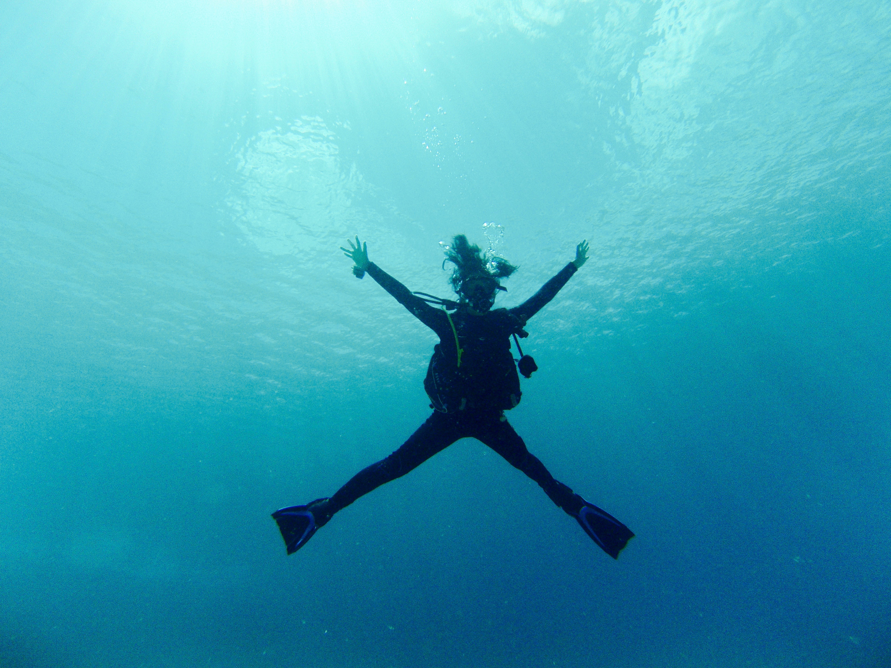
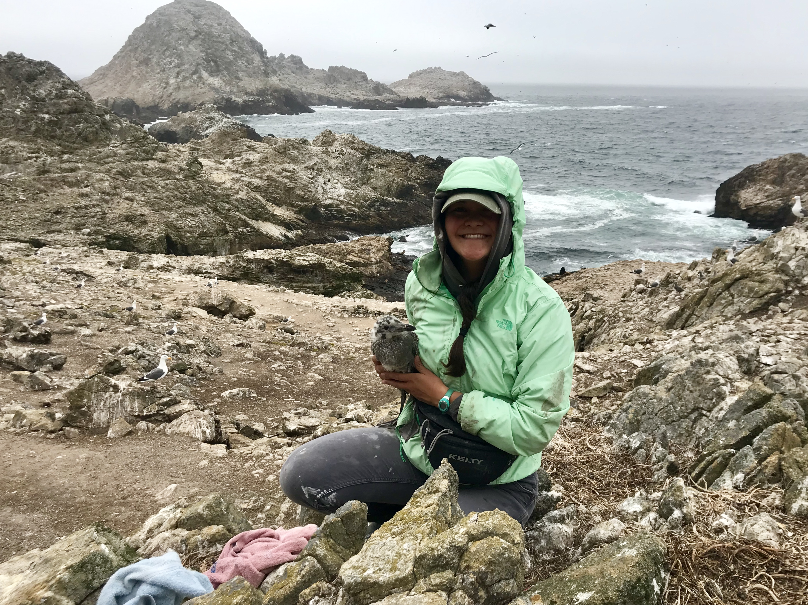

```{r setup, include=FALSE}
knitr::opts_chunk$set(echo = FALSE)
```

I graduated from the University of California, Los Angeles in 2017 with a Bachelor of Science in Ecology, Behavior, and Evolution. Growing up in Santa Cruz, California, I always felt a deep connection to the ocean and surrounding coastal ecosystems. This love was intensified through my undergraduate career, during which I participated in two field biology courses in Australia and Southern California. 



Upon graduating from UCLA, I began working for Point Blue Conservation Science in Northern California, studying marine predator diet. I was extremely lucky to join four at-sea research cruises in partnership with NOAA and local National Marine Sanctuaries and learned the tumultuous art of working at sea (medication is key!!). Following my position in the marine lab, I continued to work for Point Blue, studying breeding seabirds on Southeast Farallon Island. While dodging furious Western Gulls and extracting tiny Pigeon Guillemot chicks from rocky crevices, my passion for marine conservation grew. 



I am excited to further my education at the Bren School, where I hope to explore the dynamics between human populations and their neighboring marine ecosystems. I intend to specialize in Conservation Planning and Coastal Marine Resources Management, and look forward to gaining exposure to various career paths in the field.   